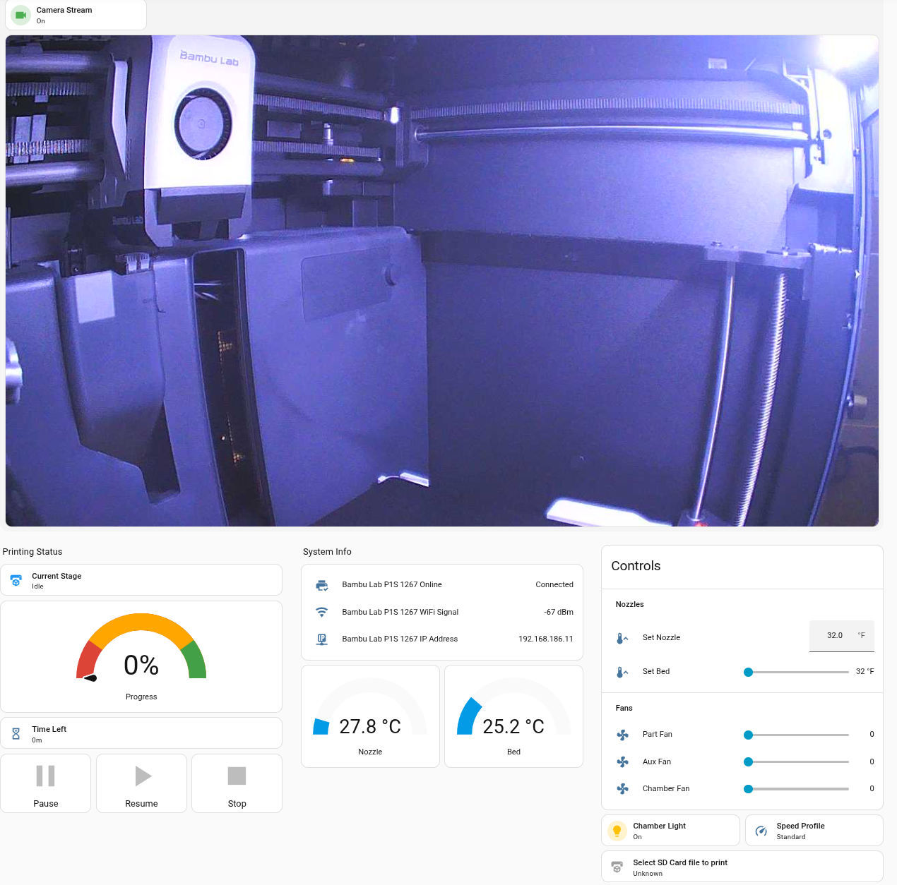

# BambuLAN

**BambuLAN** is a high-performance Go ecosystem for complete, cloud-free management of Bambu Lab 3D printers over the local network (LAN mode).

It provides a robust developer library, a powerful CLI tool, and a modern, real-time web dashboard—allowing you to monitor status, control hardware, view camera streams, and manage files with total privacy and near-zero latency.

## Features

- **Real-time Monitoring**: Receive updates on temperatures, fans, print progress, and detailed printer states via high-performance SSE.
- **Connection Health**: Visual status indicator for the dashboard-to-server link.
- **Full Printer Control**:
    - Manage print jobs (`start`, `pause`, `resume`, `stop`, `skip objects`).
    - Set print speed profiles (`silent`, `standard`, `sport`, `ludicrous`).
    - Control temperatures (nozzle/bed/chamber) and fan speeds (part/aux/chamber).
    - Toggle hardware options (lights, sound, camera, filament tangle detection).
- **Advanced AMS Support**:
    - Load/Unload filament and control AMS units.
    - Configure filament types, colors, and linear advance (K-values).
    - Monitor AMS humidity and tray status.
- **3MF Project Inspection**: Deep extraction of metadata, plate info, thumbnails, and filament requirements via the `bambu3mf` package.
- **Filament Management**: Resolve filament inheritance, profiles, and compatibility via the `filament` package.
- **Hardware Intelligence**: Automatic model detection (X1, P1, A1 series) to enforce hardware-specific safety limits and capabilities.
- **Home Assistant Integration**: Expose printer status and controls to Home Assistant via MQTT Discovery (automatic setup, template dashboard provided).
- **Camera Streaming**: Access live MJPEG streams and capture static frames.
- **File Management**: Full FTPS support for listing, downloading, uploading, and managing files/directories on the SD card.

## Usage

BambuLAN can be used as a standalone CLI tool/web dashboard or as a library for your own Go projects.

### CLI Tool & Web Dashboard

The easiest way to get started is with the included `bambulan` tool. It provides a full-featured CLI and a real-time web interface.


**Install:**
```bash
go install github.com/gonzalop/bambulan/cmd/bambulan@latest
```

**Run:**
BambuLAN uses environment variables for configuration, making it easy to run securely without leaking credentials in your command history.

```bash
export BAMBULAN_HOST="192.168.1.50"
export BAMBULAN_CODE="12345678"
export BAMBULAN_SERIAL="01S00A..."

# Start the web dashboard on port 8080 (default)
bambulan web

# Or bind to a specific address/port
bambulan web --bind :9000
```

See the [CLI Documentation](cmd/bambulan/README.md) for detailed usage and configuration options.

---

### Home Assistant Integration

BambuLAN can bridge your printer status to **Home Assistant** using **MQTT Discovery**.



A [Modern Dashboard Template](homeassistant/dashboard.yaml) is available to get you started quickly.

1.  **Enable Integration**: Start the web server or the dedicated bridge with your MQTT broker details. You can use flags or environment variables:
    ```bash
    # Flags
    bambulan web --mqtt-broker tcp://192.168.1.100:1883 --mqtt-user myuser --mqtt-password mypass --bind :9000

    # Using environment variables (Recommended)
    export BAMBULAN_MQTT_BROKER="tcp://192.168.1.100:1883"
    export BAMBULAN_MQTT_USER="myuser"
    export BAMBULAN_MQTT_PASSWORD="mypass"

    # Run alongside the dashboard
    bambulan web --bind :9000

    # Or run as a standalone background bridge
    bambulan ha --bind :9000
    ```
2.  **Automatic Discovery**: Home Assistant will automatically detect your printer as a new device with sensors for temperatures, progress, print stage, and a switch for the chamber light.
3.  **Generate & Import Dashboard**: Import [homeassistant/dashboard.yaml](homeassistant/dashboard.yaml) into your Home Assistant Raw Dashboard Editor. Replace `<MODEL>` with your printer model in lowercase (e.g. `x1c`) and `<LAST_4_SERIAL>` with the last 4 digits of your serial number (e.g. `5678`).

    You can generate your custom dashboard YAML file directly from the command line:
    ```bash
    sed -e 's/<MODEL>/x1c/g' -e 's/<LAST_4_SERIAL>/5678/g' homeassistant/dashboard.yaml > dashboard_x1c_5678.yaml
    ```

#### Operating Modes & Environment Variable Behavior

BambuLAN supports two ways to run the Home Assistant bridge:

- **Standalone CLI Mode (`bambulan ha`)**:
  - Designed for headless servers, systemd services, or Docker containers.
  - Connects directly to the printer using `BAMBULAN_HOST`, `BAMBULAN_CODE`, and `BAMBULAN_SERIAL` (or CLI flags `-H`, `-c`, `-s`) and to your MQTT broker (`BAMBULAN_MQTT_BROKER`, `BAMBULAN_MQTT_USER`, `BAMBULAN_MQTT_PASSWORD`).
  - Immediately connects to the printer and publishes entities to Home Assistant on startup.

- **Web Dashboard Mode (`bambulan web`)**:
  - Serves the web interface and concurrently runs the Home Assistant bridge when `BAMBULAN_MQTT_BROKER` is set (along with `BAMBULAN_MQTT_USER` and `BAMBULAN_MQTT_PASSWORD` or `--mqtt-user` / `--mqtt-password` flags if the broker requires authentication).
  - **With Printer Environment Variables**: If `BAMBULAN_HOST`, `BAMBULAN_CODE`, and `BAMBULAN_SERIAL` are set, both the web server and Home Assistant bridge auto-connect on startup.
  - **Without Printer Environment Variables**: The web server starts with a login page. Home Assistant updates automatically begin as soon as a user logs in with printer credentials via the browser.

---

### Go Library

To use BambuLAN in your own Go applications:

**Install:**
```bash
go get github.com/gonzalop/bambulan
```

**Connecting and Monitoring:**

```go
package main

import (
    "fmt"
    "log"
    "github.com/gonzalop/bambulan"
)

func main() {
    // 1. Define configuration
    host := "192.168.1.50"
    accessCode := "12345678" // Found in printer settings
    serial := "01S00A..."

    // 2. Initialize and Start Client
    client := bambulan.NewClient(host, accessCode, serial)
    if err := client.Start(); err != nil {
        log.Fatalf("Failed to connect: %v", err)
    }
    defer client.Stop()

    // 3. Subscribe to updates
    sub := client.Subscribe()
    defer sub.Cancel()

    go func() {
        for status := range sub.C {
            fmt.Printf("Nozzle: %.1f°C | Bed: %.1f°C | Progress: %d%%\n",
                status.NozzleTemp, status.BedTemp, status.McPercent)
        }
    }()

    // Keep running...
    select {}
}
```

**Sending Commands:**

```go
// Turn light on
client.MQTT.SetChamberLight(true)

// set speed to "Sport"
client.MQTT.SetSpeedProfile("3")

// Pause print
client.MQTT.PausePrint()

// 1. Upload the file first
err := client.File.UploadFile("./my-model.gcode.3mf", "/my-model.gcode.3mf", nil)
if err != nil {
    log.Fatal(err)
}

// 2. Start the print
opts := bambulan.PrintOptions{
    BedType:     "textured_plate",
    BedLeveling: true,
}
client.MQTT.StartPrint("my-model.gcode.3mf", opts)
```

**Camera Capture:**

```go
// Capture a single JPEG frame
imgData, err := client.Camera.CaptureFrame()
if err != nil {
    log.Println("Error capturing frame:", err)
}
// imgData contains the JPEG bytes
```

**File Management:**

```go
// List .3mf files
files, err := client.File.GetFiles("/", ".3mf")
if err != nil {
    log.Println("Error listing files:", err)
}

// Download a file
err := client.File.DownloadFile("/timelapse/video.mp4", "./video.mp4", nil)

// Download a directory recursively
err := client.File.DownloadDirectory("/timelapse", "./backups", true, nil)

// Upload a file with progress
onProgress := func(current, total int64) {
    fmt.Printf("Uploaded %d/%d bytes\n", current, total)
}
err := client.File.UploadFile("./model.gcode.3mf", "/model.gcode.3mf", onProgress)
```

## Acknowledgements

This project builds upon the hard work of the community in reverse-engineering the Bambu Lab network protocol. Special thanks to:

-   [bambu-connect](https://pypi.org/project/bambu-connect/) (Python)
-   [markhaehnel/bambulab](https://github.com/markhaehnel/bambulab) (Rust)

## Disclaimer

This library is not affiliated with or endorsed by Bambu Lab. Use it at your own risk. Protocol details were reverse-engineered from open-source community efforts.
