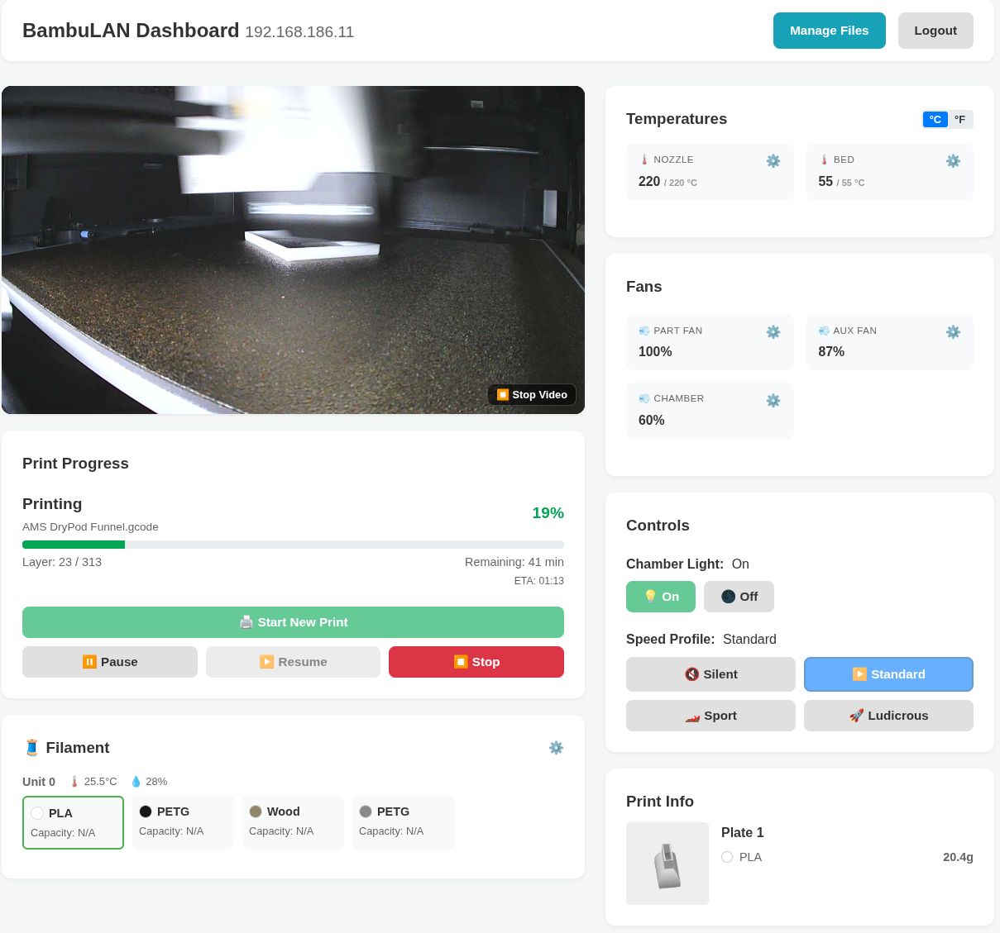
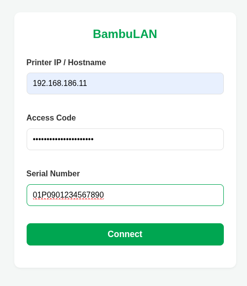
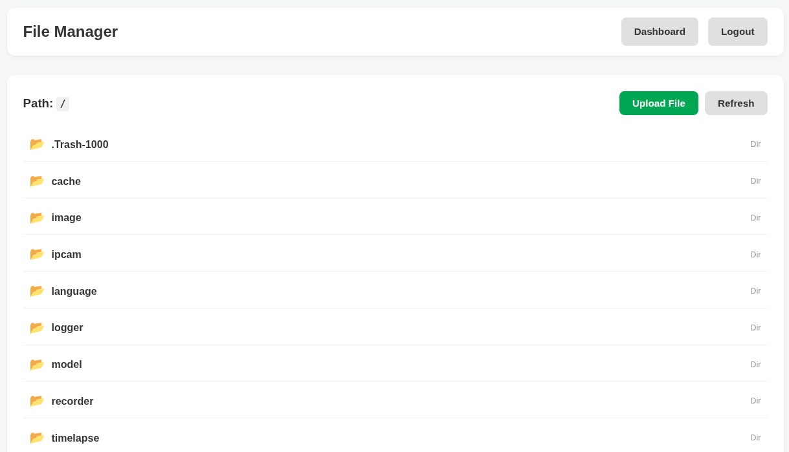
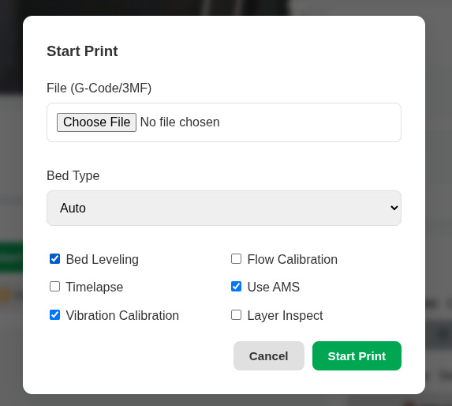

# BambuLAN CLI / Web Interface

The `bambulan` CLI tool allows you to control and monitor your Bambu Lab printer from the command line.

## Installation

```bash
go install github.com/gonzalop/bambu/cmd/bambulan
```

Or build manually:

```bash
make
```

## Usage

Global flags are required for all commands unless environment variables are set.

**Global Flags:**
- `--host` (`-H`): Printer IP or hostname (Env: `BAMBULAN_HOST`)
- `--code` (`-c`): Access code (Env: `BAMBULAN_CODE`)
- `--serial` (`-s`): Printer serial number (Env: `BAMBULAN_SERIAL`)
- `--log-level` (`-l`): Log level (debug, info, warn, error) (default: "info")

```bash
# Using flags (mixed long/short example)
./bambulan -H <IP> -c <CODE> -s <SERIAL> --log-level debug status

# Using environment variables
export BAMBULAN_HOST="192.168.1.50"
export BAMBULAN_CODE="12345678"
export BAMBULAN_SERIAL="01S00A..."
./bambulan status
```

### Commands

#### Status
Monitor printer status in real-time.
```bash
./bambulan status
# Watch mode:
./bambulan status --watch (-w)
```

#### Dump Info
Dump the full printer status as a JSON object. Useful for debugging or inspecting raw values.
```bash
./bambulan dump-info
```

#### Web Interface
Start the web dashboard (default port 8080).
```bash
./bambulan web
# Access at http://localhost:8080
```

**Options:**
- `--bind`: Address to bind to (default: `127.0.0.1:8080`)
- `--secret`: Secret for session encryption (optional, random default) (Env: `BAMBULAN_SECRET`)
- `--octoprint`: Enable OctoPrint compatibility layer (slicer integration) (Env: `BAMBULAN_OCTOPRINT`)
- `--api-key`: API Key for OctoPrint integration (optional, random default) (Env: `BAMBULAN_API_KEY`)
- `--cert`: TLS certificate file (enables HTTPS)
- `--key`: TLS private key file (enables HTTPS)
- `--max-file-size`: Maximum allowed size for 3MF file entries (default: `50MB`). Supports human-readable formats like `100MB`, `1GB`, `500KB`.

**HTTPS Support:**

For production deployments or network access, use TLS certificates to enable HTTPS:

```bash
# Generate self-signed certificate (for testing)
openssl req -x509 -newkey rsa:4096 -keyout key.pem -out cert.pem -days 365 -nodes

# Start with HTTPS
./bambulan web --bind 0.0.0.0:8443 --cert cert.pem --key key.pem
# Access at https://localhost:8443
```

When using HTTPS, cookies are automatically marked with the `Secure` flag for enhanced security.

**Slicer Integration (OrcaSlicer / PrusaSlicer / Cura):**

BambuLAN can emulate an **OctoPrint** server, allowing you to send files and control your printer directly from your favorite slicer.

1.  Start the web server with OctoPrint enabled:
    ```bash
    ./bambulan web --octoprint
    ```
2.  Copy the generated **API Key** from the console output.
3.  In your Slicer (e.g. OrcaSlicer), add a new "Physical Printer":
    *   **Host Type**: OctoPrint
    *   **Hostname**: `http://localhost:8080` (or your server's IP)
    *   **API Key**: Paste the key from step 2.
4.  You can now monitor temperatures and use "Send and Print" directly!

**Features:**
- **Dashboard**: Real-time status monitoring with high-performance Server-Sent Events (SSE).
- **Connection Indicator**: Visual badge showing real-time health of the dashboard-to-server connection.
- **Delta Updates**: Intelligent status synchronization that only sends changed fields to reduce bandwidth.
- **Dark Mode**: Native theme support for low-light environments.
- **Slicer Integration**: Standard OctoPrint API compatibility for seamless 'One-Click Print' workflows.
- **Login**: Secure access with printer credentials.
- **File Manager**: Browse files, download, and print directly.
- **Print Start**: Upload and start prints with options.
- **Security**: HttpOnly cookies, CSRF protection, and optional TLS/HTTPS support.

**Screenshots:**

### Dashboard


### Login Screen


### File Manager


### Start Print Modal



#### Printer Controls
```bash
# Turn chamber light on/off
./bambulan chamber-light on

# Set print speed (silent, standard, sport, ludicrous)
./bambulan speed sport

# Pause/Resume/Stop print
./bambulan print pause
./bambulan print resume
./bambulan print stop

# Skip objects (during print)
./bambulan print skip 1 2
```

#### Temperature & Fan
```bash
# Set temperatures
./bambulan temp head 220
./bambulan temp head 250 --tool 1  # Set second nozzle (for dual-extruder models)
./bambulan temp bed 60
./bambulan temp chamber 50        # Set chamber temperature (for supported models)

# Set fan speeds
./bambulan fan 50        # Set all fans to 50%
./bambulan fan aux 80    # Set aux fan to 80%
./bambulan fan part 100  # Set part cooling fan to 100%
```

#### Configuration
```bash
# Set printer options
./bambulan config option --name sound_enable --disable
./bambulan config option --name auto_recovery --enable

# Configure hardware
./bambulan config nozzle --diameter 0.4 --type hardened_steel
./bambulan config marker-detector --enable
```

#### Start Print
Uploads a file and starts printing.

```bash
./bambulan print start [options] <filename.gcode|.3mf>
```

**Options:**
- `--bed-type` (`-b`) <string>: Bed type (auto, textured_plate, cool_plate, engineering_plate, high_temp_plate) (default: "auto")
- `--timelapse` (`-t`): Enable timelapse (default: false)
- `--bed-leveling` (`-e`): Enable bed leveling (default: true)
- `--flow-calibration` (`-f`): Enable flow calibration (default: false)
- `--vibration-calibration` (`-V`): Enable vibration calibration (default: true)
- `--layer-inspection` (`-i`): Enable layer inspection (default: false)
- `--use-ams` (`-a`): Use AMS (default: false)
- `--skip-upload`: Skip upload and use the provided path as an existing file on the printer.

#### Camera
Capture a single frame from the camera.
```bash
./bambulan capture [output.jpg]
```

#### File Management
Interact with the printer's SD card via FTPS.

```bash
# List files
./bambulan file ls /
./bambulan file ls /timelapse --extension .mp4

# Download file
./bambulan file download /timelapse/video.mp4 [./local_video.mp4]

# Move/Rename
./bambulan file mv /old/path /new/path

# Make directory
./bambulan file mkdir /models/my_project

# Remove (Recursive supported!)
./bambulan file rm /models/old_project -r
```

#### AMS Management

**Control:**
```bash
# Load/Unload filament
./bambulan ams unload
./bambulan ams load --target 0  # Target: 0-15 (AMS), 254 (External)

# Pause/Resume AMS
./bambulan ams control pause
./bambulan ams control resume
```

**Settings:**
```bash
# Set user settings (e.g. read on startup)
./bambulan ams user-setting -u 0 --startup-read

# Set K-Factor (Linear Advance)
./bambulan ams k-factor --tray 0 --k 0.020
```

**Filament Properties:**
```bash
# Update filament info
./bambulan ams filament -u 0 -S 0 -C FFFFFFFF \
  --type "Bambu PLA Basic" \
  --resources ./resources/filament
```

**Options:**
- `--unit` (`-u`): AMS Unit ID (0-3) (default: 0)
- `--slot` (`-S`): Slot ID (0-3) (required)
- `--color` (`-C`): Color in HEX (RRGGBBAA) (required)
- `--type` (`-t`): Filament Type (e.g. 'PLA Basic') OR search term for lookup (required)
- `--filament-id` (`-f`): Filament ID (e.g. 'GFA00'). Optional if lookup finds a match.
- `--setting-id` (`-i`): Setting ID (e.g. 'GFSA16_00'). Optional if lookup finds a match.
- `--resources` (`-R`): Path to filament JSON resources (Env: `BAMBULAN_RESOURCES`)
